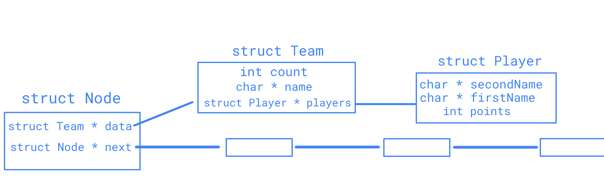

## LAN Party - Marius-Augustin Niţu, ACS 2023

**Premise**: The Faculty of Automatic Control and Computer Science through LSAC organizes a LAN Party every semester attended by all students who want to test their skills in a certain game. The goal is to create an application (program) that can automate this process.

* LAN Party is a university project which implements complex Data Structures in order to properly manage participants and their scores for the event. 
* The following Data Structures are implemented: Linked List, Stack, Queue, Binary Search Tree, AVL Tree.

### TASKS Description

* **TASK1** - Read the input data (Teams) into the Linked List. The following functions were implemented: `allocateNode`, `freeNode`, `deleteNode`, `displayList`, `deleteList`. 

An illustration of the Linked List can be observed in the figure.

* **TASK2** - Reduce the number of Nodes (Teams) to the nearest power of 2.
* **TASK3** - Match the Teams by implementing a fighting Queue and a results Stack, until 8 Teams remain. The following functions were implemented: `pop`, `push`, `enQueue`, `deQueue`, `fillQueue`.
* **TASK4** - Implement a Binary Search Tree with the remaining Teams.
* **TASK5** - Implement an AVL Tree with the remaining Teams.

### Further Notes

* The project purpose is educational, first and foremost. 
* The instructions and requirements are available on OCW.
* Course Data Structures and Algorithms, ACS IS 2023.